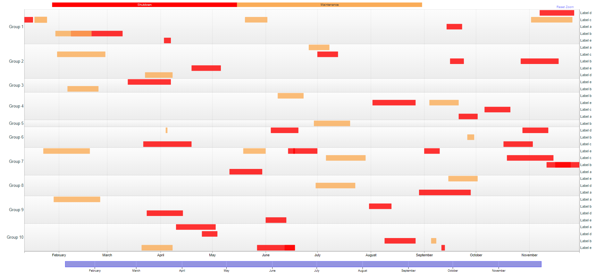

# timelineschart

> R interface to [timelines-chart](https://github.com/vasturiano/timelines-chart)

<!-- badges: start -->
[](https://www.tidyverse.org/lifecycle/#experimental)
[](https://github.com/dreamRs/timelineschart/actions/workflows/R-CMD-check.yaml)
<!-- badges: end -->

## Installation

You can install from [GitHub](https://github.com/dreamRs/timelineschart) with:

``` r
remotes::install_github("dreamRs/timelineschart")
```

## Example

Visualise a planning as a timeline chart:

``` r
## Some data
dates <- sample(seq(as.Date("2019-01-01"), as.Date("2019-11-30"), by = "day"), 55)
planning <- data.frame(
  group = paste("Group", rep(1:10, sample(1:10, 10))),
  label = paste("Label", letters[1:5][sample.int(5, 55, TRUE)]),
  start = dates,
  end = dates + sample(1:30, 55, TRUE),
  value = sample(c("Shutdown", "Maintenance"), 55, TRUE),
  stringsAsFactors = FALSE
)

## Timeline chart
timelines(data = planning, line_height = 24) %>%
  set_scale(palette = c("#FF0000", "#FAAC58"), discrete = TRUE) %>% 
  set_time(use_utc = TRUE)
```




